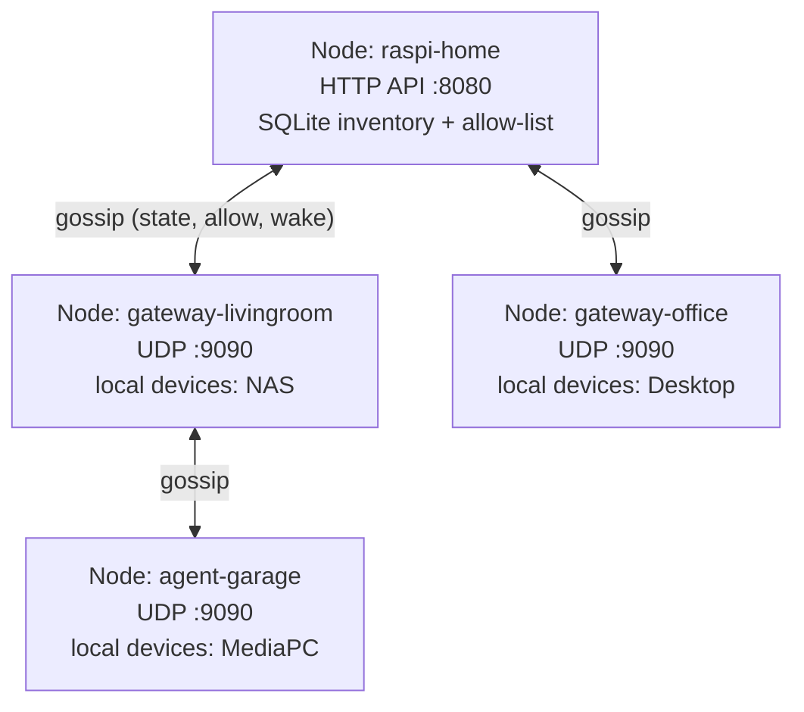
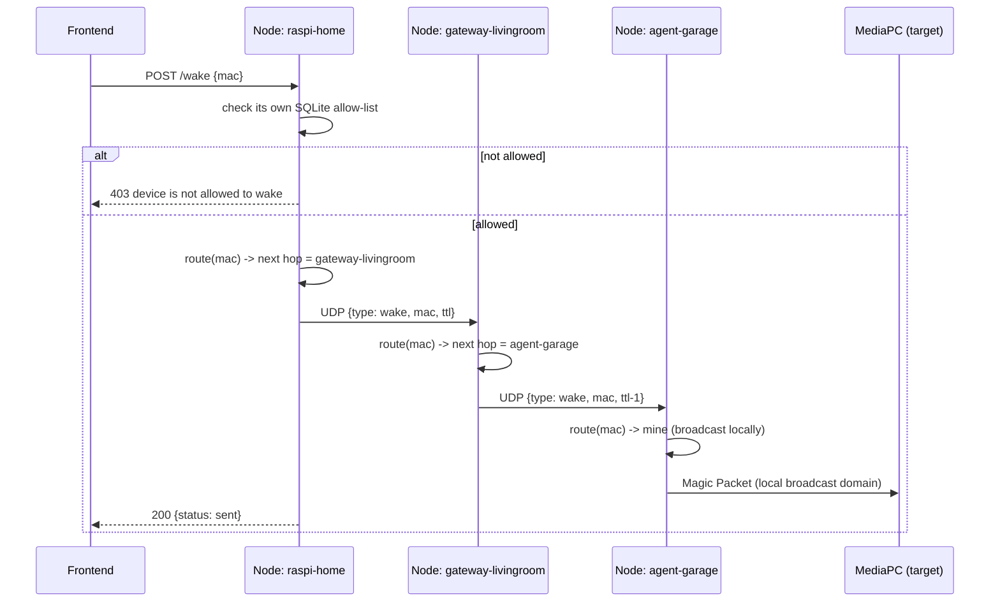

# Home Gateway Technical Requirements (MVP)

## Overview

The Raspberry Pi is the **Home Controller** and the **single source of truth**. It does **not** need direct Layer 2 visibility to every subnet. Instead, it delegates discovery and Wake-on-LAN to the gateway responsible for each network.

---

## High-Level Architecture

```text
                         Internet
                             │
                      (Optional Cloud)
                             │
                       Raspberry Pi
                     Home Controller
                             │
        ┌────────────────────┴────────────────────┐
        │                                         │
 Local Discovery                          Registered Gateways
 (same subnet)                            (nested networks)
        │                                         │
        │                             ┌───────────┴───────────┐
        │                             │                       │
   MikroTik Plugin             MikroTik Gateway         ESP32 Gateway
                                     │                       │
                                Discovery + WoL        Discovery + WoL
                                     │                       │
                             Local Broadcast         Local Broadcast
```

---

# Raspberry Pi Responsibilities

The Raspberry Pi owns:

* Device inventory
* MAC ↔ IP mapping
* Friendly names
* Device tags
* Wake-on-LAN policies
* Gateway registry
* Network topology
* REST API
* Authentication
* Optional cloud synchronization

The Raspberry Pi **never broadcasts WoL packets outside its own subnet**.

---

# Gateway Responsibilities

Every gateway (MikroTik, ESP32, OpenWrt, Linux, etc.) implements two capabilities.

## 1. Discovery Provider

Reports:

* MAC
* IP
* Hostname (optional)
* Online status

Example:

```json
{
  "gateway_id": "mikrotik-livingroom",
  "devices": [
    {
      "mac": "AA:BB:CC:DD:EE:FF",
      "ip": "192.168.50.10"
    }
  ]
}
```

---

## 2. Wake Provider

Receives:

```json
{
  "mac": "AA:BB:CC:DD:EE:FF"
}
```

Executes:

```
Magic Packet
```

Only inside its local broadcast domain.

---

# Device Inventory

```yaml
devices:

- mac: AA:BB:CC:DD:EE:FF
  ip: 192.168.50.10
  name: NAS
  gateway_id: mikrotik-livingroom
  wol: true

- mac: 11:22:33:44:55:66
  ip: 192.168.3.20
  name: Desktop
  gateway_id: local
  wol: true
```

Every device belongs to exactly **one gateway**.

---

# Gateway Registration

Each gateway registers once.

```json
{
  "gateway_id": "mikrotik-livingroom",
  "parent": "raspi-home",
  "subnets": [
    "192.168.50.0/24"
  ],
  "capabilities": [
    "discovery",
    "wol"
  ]
}
```

---

# Wake-on-LAN Flow

```
User
 │
 │ Wake NAS
 ▼
Raspberry Pi
 │
 │ Lookup MAC
 ▼
Inventory
 │
 │ gateway_id = mikrotik-livingroom
 ▼
Gateway Manager
 │
 │ POST /wake
 ▼
MikroTik Gateway
 │
 │ Broadcast Magic Packet
 ▼
NAS
```

---

# Nested Network Support

```
Raspberry Pi
      │
Gateway A
      │
Gateway B
      │
Gateway C
      │
Target Device
```

The Raspberry Pi stores only:

```yaml
gateway_id: gateway-c
```

It does **not** calculate routing paths or router hops.

The owning gateway is responsible for waking devices on its local subnet.

---

# Gateway Interface

```go
type Gateway interface {
    ID() string

    Discover(ctx context.Context) ([]Device, error)

    Wake(ctx context.Context, mac net.HardwareAddr) error

    Heartbeat(ctx context.Context) error
}
```

Implementations:

* Raspberry Pi Local Scanner
* MikroTik
* ESP32
* OpenWrt
* Linux Agent

---

# Discovery Sources

| Source       | Discovery | Wake | Notes                |
| ------------ | --------- | ---- | -------------------- |
| Raspberry Pi | ✅         | ✅    | Local subnet only    |
| MikroTik     | ✅         | ✅    | RouterOS script/API  |
| ESP32        | ✅         | ✅    | Local subnet gateway |
| OpenWrt      | ✅         | ✅    | Local agent          |
| Linux        | ✅         | ✅    | Local agent          |

---

# Design Principles

* Raspberry Pi is the single source of truth.
* Every device has exactly one **Owning Gateway**.
* Discovery and policy are separate concerns.
* Wake-on-LAN is always executed by the Owning Gateway.
* The controller is vendor-independent.
* Nested routers are supported without changing the controller logic.
* New gateway types can be added by implementing the `Gateway` interface.

---

# Implementation: This Repo

`home-wol-gateway` is a single binary run as a **mesh of peers**, not a fixed
tree. Every node — raspi controller, subnet gateway, nested agent — runs the
same code; there's no special "root" role in the protocol.

* `node.peers` lists other nodes' UDP addresses to gossip with directly. An
  edge only needs configuring on one side — the other side learns it
  automatically once it hears back.
* Nodes on the **same subnet** don't even need `peers` set — each one
  broadcasts a signed "hello" beacon to its own port on the local segment,
  and anything sharing the same `security.psk` that hears it is added as a
  neighbor automatically. `peers` is only required to bridge into a
  *different* subnet, since broadcast can't cross a router.
* `node.listen_http_addr` is independent of both of those: any node can
  expose its current view of the mesh over HTTP for a frontend, whether or
  not it has peers configured.

Every node does local discovery (`ip neigh`) on a timer, then gossips its own
contribution — its devices, its identity, and the edges it's currently
adjacent to — to every peer it knows. Each node relays anything new it hears
onward to its other peers (flood), deduped by a message ID so the flood
terminates even when the mesh has cycles. This is what lets arbitrary
topologies work — a strict tree, a ring, sibling gateways linked directly to
each other — without any node needing to know the mesh's overall shape.

## Security

Every UDP message is signed and every HTTP request is authenticated — the
process refuses to start without both configured:

* `security.psk` — one shared secret, identical on every node in the mesh.
  Each node derives its own signing key from it (`HMAC-SHA256(psk, node_id)`),
  so a node without the right `psk` can't forge messages, and its packets are
  silently dropped by everyone else. Signed messages also carry a timestamp,
  rejected outside a 60s window, to bound replay of a captured packet.
* `security.api_token` — required on any node with `listen_http_addr` set.
  Every HTTP request needs `Authorization: Bearer <api_token>`, checked with
  a constant-time comparison.

Generate both with `openssl rand -hex 32`. `psk` must match across the whole
mesh; `api_token` only needs to match wherever your frontend connects.



Each node remembers, per MAC, which direct neighbor it last heard that device
through — that's the entire routing table. A wake request hops from neighbor
to neighbor toward whichever one owns the MAC, with a TTL as a safety net
against a stale route looping.

## Waking a device anywhere in the mesh



## Repo layout

```
home-wol-gateway/
├── backend/   Go mesh node (this whole doc) -- build/run from here
└── frontend/  Svelte UI -- points at any node's HTTP API
```

## Quick setup: connecting two nodes

Simplest possible mesh: two nodes, one with HTTP on (for the frontend),
one without.

1. Pick a shared secret both nodes will use -- any random string works,
   e.g. `openssl rand -hex 32`. This is `security.psk`, and it must be
   **identical** on every node you want in the same mesh.

2. **Node A** (`backend/config.yaml`, has HTTP on):

   ```yaml
   node:
     id: raspi-home
     listen_udp_addr: ":9090"
     listen_http_addr: ":8080"
   discovery:
     command: ip
     args: [neigh]
   wake:
     broadcast_addr: "255.255.255.255"
     port: 9
   db:
     path: "./data/inventory.db"
   security:
     psk: "<the shared secret from step 1>"
     api_token: "<a second random string, for the frontend>"
   ```

3. **Node B** (a different machine's `backend/config.yaml`, UDP-only):

   - **Same subnet as node A?** Leave `peers: []` empty — as long as both
     use the same `listen_udp_addr` port (`:9090` here), they'll find each
     other automatically via the LAN broadcast beacon.
   - **Different subnet?** Set `peers: ["<node A's IP>:9090"]` — broadcast
     can't cross a router, so this one link has to be explicit.

   ```yaml
   node:
     id: gateway-livingroom
     listen_udp_addr: ":9090"
     peers: [] # or ["<node A's IP>:9090"] if on a different subnet
   discovery:
     command: ip
     args: [neigh]
   wake:
     broadcast_addr: "255.255.255.255"
     port: 9
   security:
     psk: "<the same shared secret from step 1>"
   ```

4. Run both (`go run .` in each's directory, or the built binary). Give
   it a `report_interval` or two, then check node A sees node B:

   ```
   curl -H "Authorization: Bearer <api_token>" http://<node A>:8080/topology
   ```

   Two nodes and one edge means it worked. Add a third node the same way
   -- point its `peers` at *either* existing node, it doesn't have to be
   the same one every time.

That's the whole setup. No parent/child to get right, no ordering to
follow -- whichever side lists the other in `peers` is enough for both to
find each other.

The `sent` response is fire-and-forget once the request leaves the node the
frontend is talking to — there's no ack chain back, matching the rest of the
mesh's push-only design.
